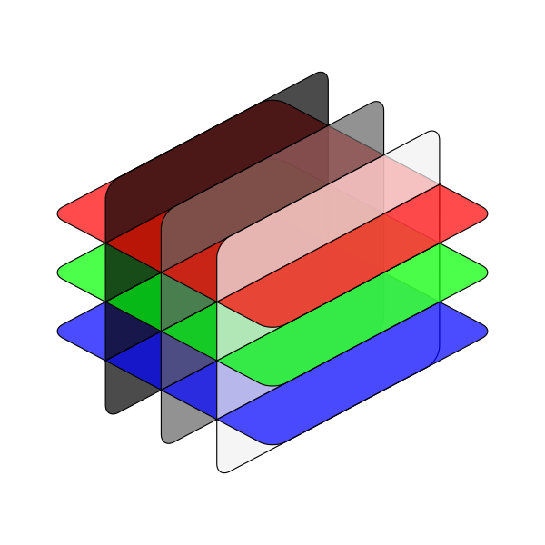

################################
Welcome to vIQA's documentation!
################################

.. toctree::
   :hidden:

   getting_started
   user_guide
   api_reference

.. toctree::
   :hidden:
   :caption: Development

   changelog
   internal_api_reference
   developer_guide
   Github <https://github.com/3dct/vIQA>

vIQA (volumetric Image Quality Assessment) provides an extensive assessment suite for image quality of 2D-images or 3D-volumes as a python package.
Image Quality Assessment (IQA) is a field of research that aims to quantify the quality of an image. This is usually
done by comparing the image to a reference image (full-reference metrics), but can also be done by evaluating the image
without a reference (no-reference metrics). The reference image is usually the original image, but can also be
another image that is considered to be of high quality. The comparison is done by calculating a metric that quantifies
the difference between the two images or for the image itself. These quality metrics are used in various fields, such as
medical imaging, computer vision, and image processing. For example the efficiency of image compression algorithms can be
evaluated by comparing the compressed image to the original image.
This package implements several metrics to compare two images or volumes using different IQA metrics. In addition, some
metrics are implemented that can be used to evaluate a single image or volume.

The following metrics are implemented:

.. table:: Implemented metrics
    :widths: auto

    +-----------+-----------------------------------------------+------+-----------------------+---------------------------+------------------------------------------+-------------------------+---------------------------+-----------+
    | Metric    | Name                                          | Type | Dimensional behaviour | Colour Behaviour          | Range (different/worst - identical/best) | Tested                  | Validated                 | Reference |
    +===========+===============================================+======+=======================+===========================+==========================================+=========================+===========================+===========+
    | PSNR      | Peak Signal to Noise Ratio                    | FR   | 3D native             | :math:`\checkmark`        | :math:`[0, \infty)`                      | :math:`\checkmark`      | :math:`\checkmark`        |           |
    +-----------+-----------------------------------------------+------+-----------------------+---------------------------+------------------------------------------+-------------------------+---------------------------+-----------+
    | RMSE      | Root Mean Square Error                        | FR   | 3D native             | :math:`\checkmark`        | :math:`(\infty, 0]`                      | :math:`\checkmark`      | :math:`\checkmark`        |           |
    +-----------+-----------------------------------------------+------+-----------------------+---------------------------+------------------------------------------+-------------------------+---------------------------+-----------+
    | UQI [*]_  | Universal Quality Index                       | FR   | 3D native             | (:math:`\checkmark`) [*]_ | :math:`[-1, 1]`                          | :math:`\times`          | (:math:`\checkmark`) [*]_ | [1]_      |
    +-----------+-----------------------------------------------+------+-----------------------+---------------------------+------------------------------------------+-------------------------+---------------------------+-----------+
    | SSIM      | Structured Similarity                         | FR   | 3D native             | (:math:`\checkmark`) [*]_ | :math:`[-1, 1]` [*]_                     | :math:`\checkmark`      | :math:`\checkmark`        | [2]_      |
    +-----------+-----------------------------------------------+------+-----------------------+---------------------------+------------------------------------------+-------------------------+---------------------------+-----------+
    | MS-SSIM   | Multi-Scale Structural Similarity             | FR   | 3D slicing            | Unknown                   | :math:`[0, 1]`                           | :math:`\times`          | :math:`\checkmark`        | [3]_      |
    +-----------+-----------------------------------------------+------+-----------------------+---------------------------+------------------------------------------+-------------------------+---------------------------+-----------+
    | FSIM      | Feature Similarity                            | FR   | 3D slicing            | :math:`\checkmark`        | :math:`[0, 1]`                           | :math:`\checkmark`      | :math:`\checkmark`        | [4]_      |
    +-----------+-----------------------------------------------+------+-----------------------+---------------------------+------------------------------------------+-------------------------+---------------------------+-----------+
    | VIFp      | Visual Information Fidelity in *pixel* domain | FR   | 3D slicing            | Unknown                   | :math:`[0, \infty)` [*]_                 | :math:`\times`          | :math:`\times` [*]_       | [5]_      |
    +-----------+-----------------------------------------------+------+-----------------------+---------------------------+------------------------------------------+-------------------------+---------------------------+-----------+
    | VSI       | Visual Saliency-based Index                   | FR   | 3D slicing            | :math:`\checkmark` [*]_   | :math:`[0, 1]`                           | :math:`\times`          | :math:`\times`            | [6]_      |
    +-----------+-----------------------------------------------+------+-----------------------+---------------------------+------------------------------------------+-------------------------+---------------------------+-----------+
    | MAD       | Most Apparent Distortion                      | FR   | 3D slicing            |                           | :math:`[0, \infty)`                      | :math:`\checkmark`      | :math:`\times`            | [7]_      |
    +-----------+-----------------------------------------------+------+-----------------------+---------------------------+------------------------------------------+-------------------------+---------------------------+-----------+
    | GSM       | Gradient Similarity                           | FR   | 3D native or slicing  |                           | :math:`[0, 1]`                           | :math:`\times`          | :math:`\times`            | [8]_      |
    +-----------+-----------------------------------------------+------+-----------------------+---------------------------+------------------------------------------+-------------------------+---------------------------+-----------+
    | CNR       | Contrast to Noise Ratio                       | NR   | 3D native             |                           | :math:`[0, \infty)`                      | :math:`\checkmark`      | :math:`\times`            | [9]_      |
    +-----------+-----------------------------------------------+------+-----------------------+---------------------------+------------------------------------------+-------------------------+---------------------------+-----------+
    | SNR       | Signal to Noise Ratio                         | NR   | 3D native             | :math:`\checkmark`        | :math:`[0, \infty)`                      | :math:`\checkmark`      | :math:`\times`            |           |
    +-----------+-----------------------------------------------+------+-----------------------+---------------------------+------------------------------------------+-------------------------+---------------------------+-----------+
    | Q-Measure | Q-Measure                                     | NR   | 3D only [*]_          | :math:`\times`            | :math:`[0, \infty)`                      | :math:`\times`          | :math:`\times`            | [10]_     |
    +-----------+-----------------------------------------------+------+-----------------------+---------------------------+------------------------------------------+-------------------------+---------------------------+-----------+

.. [*] UQI is a special case of SSIM. Also see [2]_.
.. [*] The metric is calculated channel-wise for color images. The values are then averaged after weighting.
.. [*] As UQI is a special case of SSIM, the validation of SSIM is also valid for UQI.
.. [*] The metric is calculated channel-wise for color images. The values are then averaged after weighting.
.. [*] The range for SSIM is given as :math:`[-1, 1]`, but is usually :math:`[0, 1]` in practice.
.. [*] Normally :math:`[0, 1]`, but can be higher than 1 for modified images with higher
    contrast than reference images.
.. [*] The calculated values for VIFp are probably not correct in this implementation.
    Those values should be treated with caution as further testing is required.
.. [*] The original metric supports RGB images only. This implementation can work
    with grayscale images by copying the luminance channel 3 times.
.. [*] The Q-Measure is a special metric designed for CT images. Therefore it only works
    with 3D volumes.

If you want to use the package, please have a look at the :doc:`getting_started` page.
If you find bugs, please head to the `Github issue tracker`_ and open an issue.

.. _Github issue tracker: https://github.com/3dct/vIQA/issues

*******
Contact
*******

If you have any questions, please contact the author at: :email:`lukas.behammer@fh-wels.at`.

..
    & Citing

******************
Indices and tables
******************

* :ref:`genindex`
* :ref:`modindex`
* :ref:`search`

**********
References
**********

.. [1] Wang, Z., & Bovik, A. C. (2002). A Universal Image Quality Index. IEEE SIGNAL
    PROCESSING LETTERS, 9(3). https://doi.org/10.1109/97.995823
.. [2] Wang, Z., Bovik, A. C., Sheikh, H. R., & Simoncelli, E. P. (2004). Image quality
    assessment: From error visibility to structural similarity. IEEE Transactions on
    Image Processing, 13(4), 600–612. https://doi.org/10.1109/TIP.2003.819861
.. [3] Wang, Z., Simoncelli, E. P., & Bovik, A. C. (2003). Multi-scale structural
    similarity for image quality assessment. The Thirty-Seventh Asilomar Conference on
    Signals, Systems & Computers, 1298–1402. https://doi.org/10.1109/ACSSC.2003.1292216
.. [4] Zhang, L., Zhang, L., Mou, X., & Zhang, D. (2011). FSIM: A feature similarity
    index for image quality assessment. IEEE Transactions on Image Processing, 20(8).
    https://doi.org/10.1109/TIP.2011.2109730
.. [5] Sheikh, H. R., & Bovik, A. C. (2006). Image information and visual quality. IEEE
    Transactions on Image Processing, 15(2), 430–444.
    https://doi.org/10.1109/TIP.2005.859378
.. [6] Zhang, L., Shen, Y., & Li, H. (2014). VSI: A visual saliency-induced index for
    perceptual image quality assessment. IEEE Transactions on Image Processing, 23(10),
    4270–4281. https://doi.org/10.1109/TIP.2014.2346028
.. [7] Larson, E. C., & Chandler, D. M. (2010). Most apparent distortion: full-reference
    image quality assessment and the role of strategy. Journal of Electronic Imaging, 19
    (1), 011006. https://doi.org/10.1117/1.3267105
.. [8] Liu, A., Lin, W., & Narwaria, M. (2012). Image quality assessment based on
    gradient similarity. IEEE Transactions on Image Processing, 21(4), 1500–1512.
    https://doi.org/10.1109/TIP.2011.2175935
.. [9] Desai, N., Singh, A., & Valentino, D. J. (2010). Practical evaluation of image
    quality in computed radiographic (CR) imaging systems. Medical Imaging 2010: Physics
    of Medical Imaging, 7622, 76224Q. https://doi.org/10.1117/12.844640
.. [10] Reiter, M., Weiß, D., Gusenbauer, C., Erler, M., Kuhn, C., Kasperl, S., &
    Kastner, J. (2014). Evaluation of a Histogram-based Image Quality Measure for X-ray
    computed Tomography. 5th Conference on Industrial Computed Tomography (iCT) 2014,
    25-28 February 2014, Wels, Austria. e-Journal of Nondestructive Testing Vol. 19(6).
    https://www.ndt.net/?id=15715
